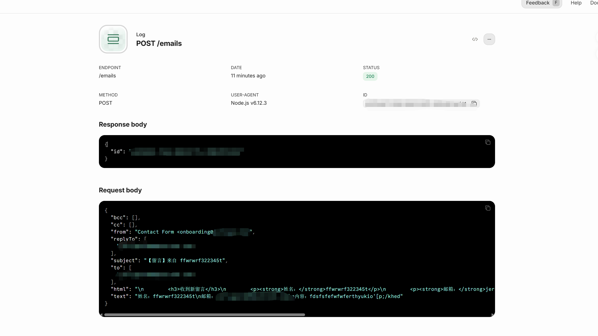
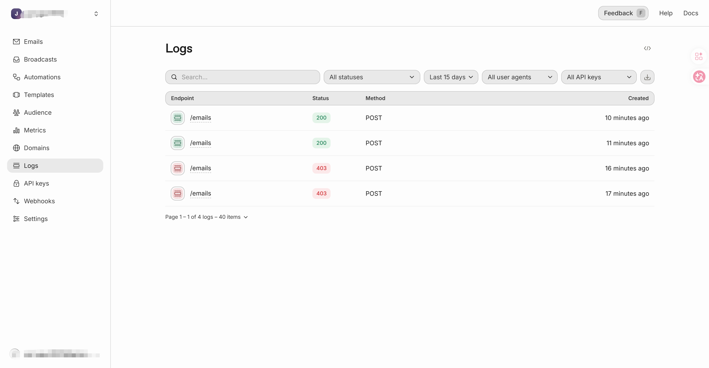
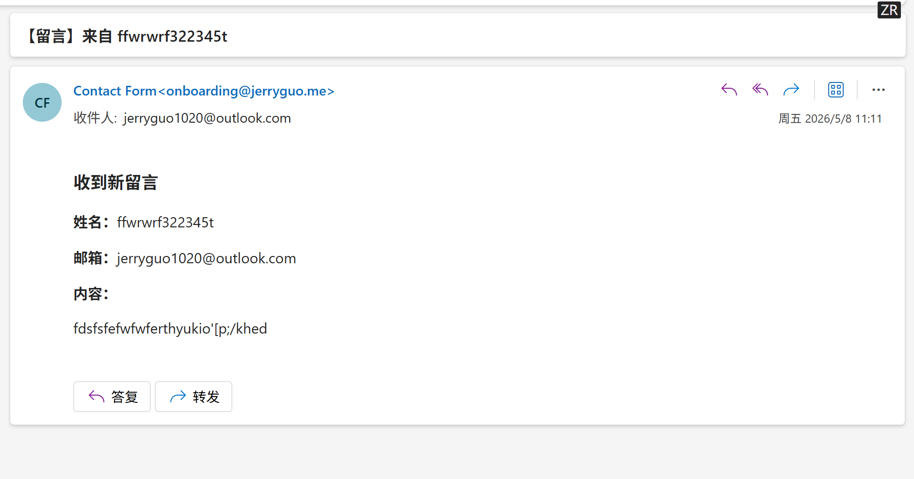
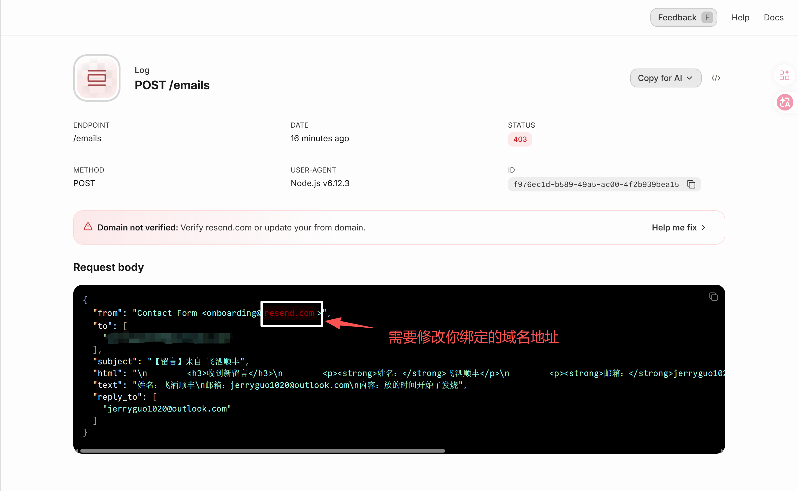

# EmailTest 项目配置指南

## 项目结构

```
emailTest/
├── api/          # NestJS 后端 (端口 30001)
│   └── src/
│       └── mail/
│           ├── mail.service.ts   # 邮件发送逻辑
│           └── mail.module.ts    # 邮件模块
├── web/          # Vue3 前端 (端口 5173)
│   └── src/
│       └── components/
│           └── ContactForm.vue    # 联系表单组件
├── README.md     # 你现在看的这个文件
└── .gitignore    # Git 忽略规则
```

---

## 一、配置 .env 文件

在后端 `api/` 目录下创建或编辑 `.env` 文件：

```bash
cd api
touch .env
```

文件内容：

```
RESEND_API_KEY=re_你的APIKey
```

**如何获取 API Key：**

1. 登录 [Resend 后台](https://resend.com/emails)
2. 左侧菜单点击 **API Keys**
3. 点击 **Create API Key**
4. 复制生成的 Key，格式为 `re_` 开头

> **注意**：`.env` 文件包含敏感信息，已在 `.gitignore` 中忽略，**不要提交到 Git**

---

## 二、配置发件人和收件人

打开 `api/src/mail/mail.service.ts`，找到 `sendContact` 方法：

```typescript
await this.resend.emails.send({
    from: 'Contact Form <onboarding@你的域名>',  # 修改这里
    to: '你的收件邮箱',                           # 修改这里
    replyTo: email,
    subject: `【留言】来自 ${name}`,
    text: `姓名：${name}\n邮箱：${email}\n内容：${message}`,
    html: `
        <h3>收到新留言</h3>
        <p><strong>姓名：</strong>${name}</p>
        <p><strong>邮箱：</strong>${email}</p>
        <p><strong>内容：</strong></p>
        <p>${message.replace(/\n/g, '<br>')}</p>
    `,
});
```

### `from` 字段说明

| 方式 | 值 | 说明 |
|------|-----|------|
| 默认发件地址 | `onboarding@resend.com` | Resend 免费版提供的固定地址 |
| 自定义域名 | `Contact Form <noreply@jerryguo.me>` | 需要在 Resend 后台验证你的域名 |

如果使用自定义域名作为发件地址，需要在 Resend 后台：
1. 左侧菜单点击 **Domains**
2. 点击 **Add Domain** 添加你的域名（如 `jerryguo.me`）
3. 按照指示添加 DNS 记录完成验证
4. 验证通过后，即可使用 `noreply@jerryguo.me` 作为发件地址

### `to` 字段说明

填写你希望接收邮件的邮箱地址，例如：

- `jerryguo1020@outlook.com`
- `admin@jerryguo.me`

> **重要**：Resend 免费版要求收件邮箱必须已在后台验证，否则邮件会被静默丢弃。在 Resend 后台的 **Recipient_emails** 页面添加并验证你的收件邮箱。

### `replyTo` 字段说明

设置用户点击"回复"时的目标邮箱。这里固定填入用户提交的邮箱（`email` 变量），这样你可以直接回复给提交表单的用户。

---

## 三、启动项目

### 启动后端

```bash
cd api
pnpm install      # 首次运行需要安装依赖
pnpm run start    # 启动后端，监听 30001 端口
```

看到以下输出表示启动成功：

```
API server is running on http://localhost:30001
```

### 启动前端

另开一个终端：

```bash
cd web
pnpm install      # 首次运行需要安装依赖
pnpm run dev      # 启动前端，监听 5173 端口
```

访问 `http://localhost:5173` 即可看到联系表单。

---

## 四、效果截图

### 发送成功（后端日志）



### 控制台日志



### 收件箱截图



### 未配置域名导致的 403 报错



---

## 五、常见问题

### 邮件发送成功但收件箱没有收到

1. 检查收件邮箱是否已在 Resend 后台**验证**（免费版必需）
2. 检查垃圾邮件文件夹
3. 确认 `replyTo` 没有使用未验证的邮箱

### CORS 跨域错误

后端已配置允许 `http://localhost:5173`。如果前端启动地址不是 `localhost:5173`（比如显示为 `http://10.126.1.2:5173`），需要修改 `api/src/main.ts` 中的 `origin` 配置匹配实际的前端地址。

### API Key 无效

确认 `.env` 中的 `RESEND_API_KEY` 格式正确，以 `re_` 开头，且该 Key 没有在 Resend 后台被禁用或删除。

---

## 六、相关文件路径汇总

| 用途 | 文件路径 |
|------|----------|
| 环境变量配置 | `api/.env` |
| 环境变量读取 | `api/src/app.module.ts` (ConfigModule.forRoot) |
| 邮件服务逻辑 | `api/src/mail/mail.service.ts` |
| 邮件控制器 | `api/src/mail/mail.controller.ts` |
| 前端联系表单 | `web/src/components/ContactForm.vue` |
| CORS 配置 | `api/src/main.ts` |
